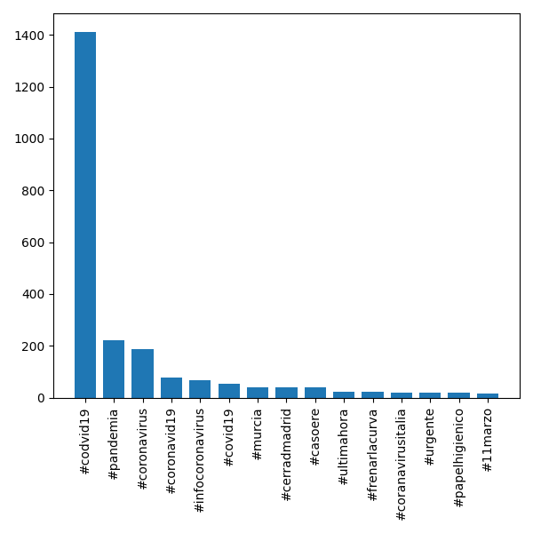
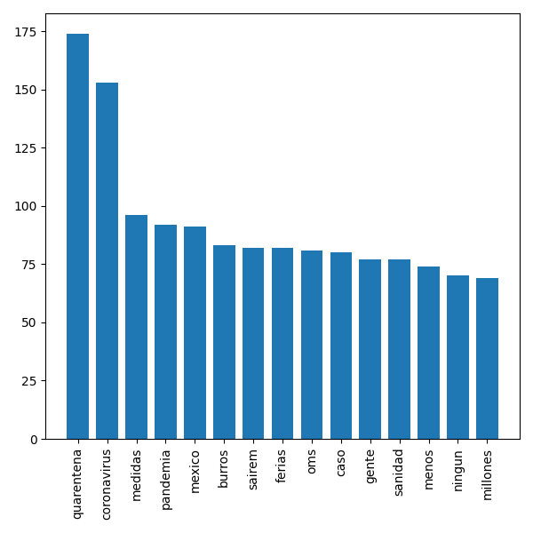
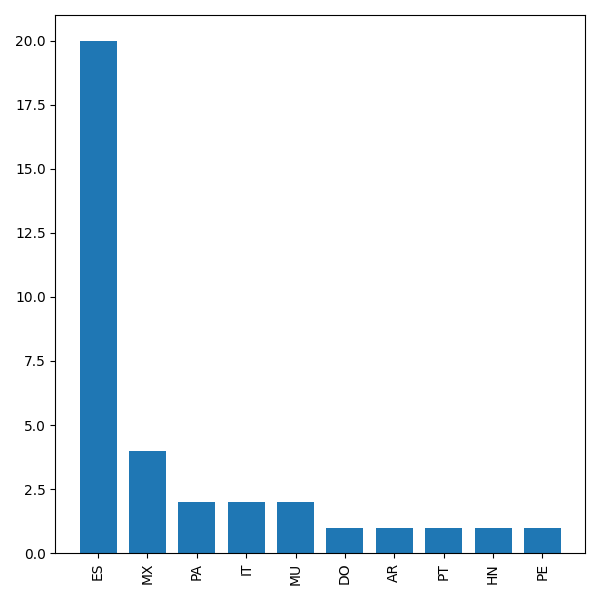

# Tweet Analysis for #covid19
> February 2020
>
> Project for the [Cloud Computing and Big Data Analytics course](https://www.fib.upc.edu/en/studies/masters/master-innovation-and-research-informatics/curriculum/syllabus/CCBDA-MIRI)
> 
>Team members: 
>* Jorrit Palfner (palfner.jorrit@estudiantat.upc.edu)
>* Mar Vidal (mar.vidal@estudiantat.upc.edu)

## Introduction
Get insight about the mood of people regarding the increasing thread of coronavirus in Spain from posted tweets with #covid19.

## Technologies used

* Python
* Twitter API
* Tweepy: Python library for accessing the Twitter API

## Reading real-time tweets, Twitter API
The streamlistener of the Tweepy library can be used to receive tweets from Twitter API in realtime. A streamlistener was used to archieve tweets filtering for a specific hashtag, #covid19, in real-time.

## Analyzing tweets - Counting terms

* Get the tweets tokenized.
* Removal of stopwords and punctuation. 
* Expand the collection of punctuation to be removed by '…', '’'. 
* Identify the expressions like 'rt', 'via' and 'RT'. They are quite common but without significant meaning therefore these were added to the list of stopwords and removed. 
* Turn the tweets words in lowercase to make no differences between the same word in lower or uppercase. 

In `TwitterAnalyzer.py`, we have used Python dictionaries to manage different type of `Counters` (tokens, hashtags and terms) and also to deal with the gathered terms. 

## Tweets hashtags and terms analysis

In total 17.7 mb of tweets were collected 2478 tweets on 11.03.2020 over approximately 15 minutes starting 21:04 and saved in a .json file and anlyzed. The results are presented in the plots below. The output of the code executed can be found in [main_output.txt](./covid19_analysis/main_output.txt).

Naturally *#covid19* is the most common hashtag and followed by *#pandemia* in second place. This indicates significant unease of the spread of the coronavirus. The number of times a hashtag is mentioned decreases to realtively low numbers after the top three. However, some of the hashtags out of the top 15 even though not mentioned very often seem to be worth mentioning and are therefore shown in the following plot. The hashtags *#murcia* and *#cerrarmadrid* appear 39 times each which indicates that these regions are particularly affected. Furthermore, hashtags like *#urgente* and *#papelhigienico* further underline the situation.



Among the 10 most common simple terms similar indications can be observed. Most eyecatching is the most common token being *quarentena* even before *coronavirus* in second place. Additionally, the words *medidas* (measures), *pandemia* and *mexico* follow the next positions. It should be remarked that the 6th position is *burros* meaning *stupid*, reflecting the panicdriven behavior of some people.
All in all the hashtags and most common tokens paint a picture of a situation which is perceived to be serious by the population.



## Evaluating the location of Tweets


To increase the insight of our results we had the idea to include location data of the tweets in the analysis. However, conducting the analysis we found that the vast majority of the tweets we gathered does not contain location data. The [main_output.txt](./Task34/main_output.txt) shows that 2443 out of 2478 have no location set.

```
 Tweets locations:
	1. Location not set: 2443
	2. ES: 20
	3. MX: 4
	4. PA: 2
	5. IT: 2
	6. MU: 2
	7. DO: 1
	8. AR: 1
	9. PT: 1
	10. HN: 1
	11. PE: 1
```

It would have been quite interesting to investigate whether there is a relation between the number of coronavirus cases in each country and the number of tweets originating from the respective country. The hypothesis we thought of was the more cases the more tweets. Unfortunately with the data we got the results can not be seen as significant because of the large number of no located tweets.

To showcase our approach we did the following brief analysis:

Position | Country code | Country | Number of coronavirus cases
------------ | ------------- | ------------- | ------------ 
1 | ES | Spain | 2,277
2 | MX | Mexico | 12
3 | PA | Panama | 14
4 | IT | Italy | 12,462
5 | MU | Mauritius | ?
6 | DO | Dominican Republic | 5
7 | AR | Argentina | 21
8 | PT | Portugal | 61
9 | HN | Honduras | 2
10 | PE | Peru |17

*Source of number of coronavirus cases: [worldometers](https://www.worldometers.info/coronavirus/#countries).*

The obtained results show a majority of the tweets originating from Spain which has a lot of cases but far less from Italy which has a lot more. These findings do not confirm our hypothesis of as more cases, more tweets. However, this could be explained by the use of different hashtags in different countries, diferring popularity of Twitter, that in Italy the outbreak has been going on for a longer time while in Spain it is still relatively new.




In conclusion this proposal taught us that a sound analysis like the one we attempted to do is more difficult than it seems at first glance. There are multiple factors to be aware of and one has to be careful how to read the results. Furthermore, does the data only show a small timeframe of 15 minutes a larger timeframe such as a day could yield more interesting and robust results. For example an earlier attempt with tweets gathered in the afternoon the same day showed totally different related hashtags there was no mention of pandemia yet. Another lesson this proposal taught us is about the limitations of our data set which did not contain much location data and other hashtags except the main one were rather scarce.

For future work, the coordinates, geo localization and language fields of the tweet object can be analysed. Moreover, a NLP can be used tp predict the language of the tweets text to extract more information about the origin of tweets.

## About the code

Some useful information about the code developed:

* Structure: Some useful functions have  been created to make the code easier to read. They are in the `utils` folder. They are:
[`get_counter_plot`](./covid19_analysis/utils/get_counter_plot.py), [`get_tweet_counter`](./covid19_analysis/utils/get_tweet_counters.py), [`get_tweet_location`](./covid19_analysis/utils/get_tweet_location.py), [`realtime`](./covid19_analysis/utils/realtime.py) and [`PreprocessTweets`](./covid19_analysis/utils/PreprocessTweets.py) (with three useful functions inside).
* Strip the accents: Large number of tweets were in Spanish, language that includes accents. Function [strip_accents`](./covid19_analysis/utils/PreprocessTweets.py) to strip all the accents from the tweets before tokenizing them.
* Get rid of other languages stop words: The firsts results analysed included stop words in other languages such as Spanish, French and Portuguese so we have included them to be discarded.
* Strip the accents from the stop words: As some of the stop words have accents and the text doesn't, we also strip the accents from them to match with the corresponding tokens. 
* Tweet object: In order to analyse the location, the Tweet object has been check to obtain the location information from the json format:
```
"place":
{
  "attributes":{},
   "bounding_box":
  {
     "coordinates":
     [[
           [-77.119759,38.791645],
           [-76.909393,38.791645],
           [-76.909393,38.995548],
           [-77.119759,38.995548]
     ]],
     "type":"Polygon"
  },
   "country":"United States",
   "country_code":"US",
   "full_name":"Washington, DC",
   "id":"01fbe706f872cb32",
   "name":"Washington",
   "place_type":"city",
   "url":"http://api.twitter.com/1/geo/id/0172cb32.json"
}
```

Even though the `country` was available, we have selected the `country_code` as we found that the country name can be in different languages. We obtained for example: *España* and *Espanya*.
